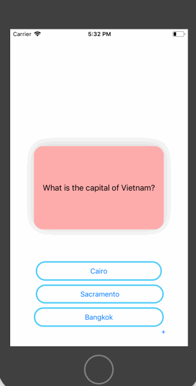

📝 `NOTE` Paste this template at the top of your existing `README.md` file from the last lab.

## Lab 2

#Flashcardz2.01

### App Walk-though

 

## Required
- [x] User can open the creation screen
- [x] User can cancel out of the creation screen
- [x] User can enter a new question and answer in the creation screen to then show it on the flashcard
- [x] Push code to GitHub
## Optional
- [ ] User gets an error if they try to create a new flashcard with no question or answer
- [ ] User can edit existing flashcard
- [ ] User can add multiple choice answers in the creation screen

# Flashcardz2

### App Description
Flashcards to learn some new facts 

### App Walk-though

 

## Required
- [x] Create New Project in Xcode
- [x] Add a view for the front side of the flashcard to display the question
- [x] Add a view for the back side of the flashcard to display the answer
- [x] Build in logic to show the answer side when the card is tapped
- [x] Push code to GitHub
## Optional
- [x] Toggle the flashcard between the question side and the answer side
- [x] Style the question and answer side of the card to better distinguish between the two sides
- [x] Add selectable multiple choice answers beneath the card
